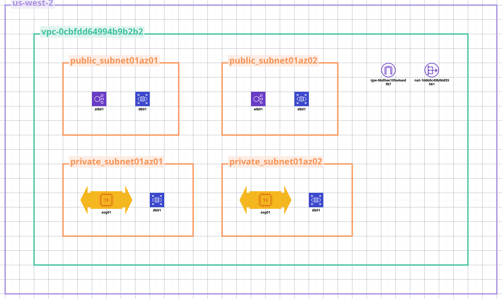

# AWSMultitierAutomation
Automated provisioning of a core multitier aws infrastructure.
TODO
- Create architectural diagram
- Figure out README-> lessons learned, important info for people to read
- Blog post running the program , link the blog and repo then post to linkedin.
- Do the same things for node actions deployment.

## Validation Endpoints

- `/`      – application landing page
- `/health` – ALB target group health check
- `/db`     – validates connectivity from app tier to RDS

